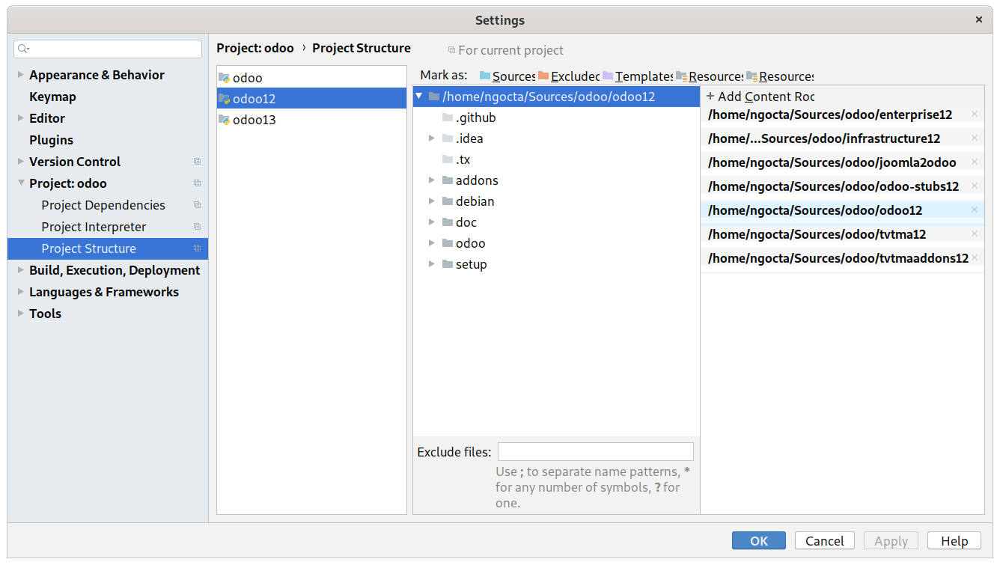
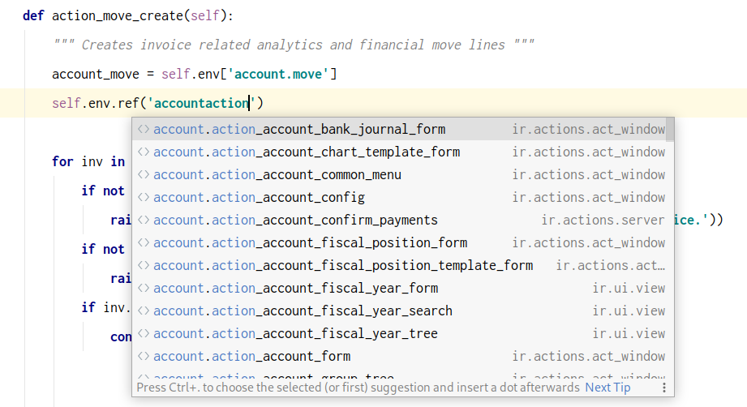

## Features
* Improve code completion and navigation for Python, XML, CSV and JavaScript
* Support working with multiple Odoo versions in one project window
* Other improvements to make PyCharm is the best IDE for Odoo

## Installation
1. Install this plugin from [JetBrains Plugins Repository](https://plugins.jetbrains.com/plugin/13499-pycharm-odoo)
or manually download and install the latest version at [here](https://github.com/trinhanhngoc/pycharm-odoo/releases).
2. (Recommended) Clone [Odoo Stubs](https://github.com/trinhanhngoc/odoo-stubs) and attach to your project to improve code analysis.
3. (Recommended) Install [XPathView](https://plugins.jetbrains.com/plugin/12478-xpathview--xslt) to support XML view inheritance features.
4. (Recommended) Install [CSV Plugin](https://plugins.jetbrains.com/plugin/10037-csv-plugin) to support code completion and navigation in CSV files.
5. (Optional) Install [PyDev.Debugger plugin for Odoo](https://github.com/trinhanhngoc/pydevd-odoo) to improve Odoo debugging.

## Usage
A sample project structure that supports multiple odoo versions:

## Screenshots
#### Python

#### XML

#### JavaScript

## Screencast
https://www.youtube.com/watch?v=SMqepH2A4_4

## Troubleshooting

If the module is installed and configured correctly but you still don't have any autocompletion, it's probably due to Pycharm index caches.

Try running the `Invalidate Caches / Restart` action, this should rebuild index caches from scratch and hopefully fix the issue.
