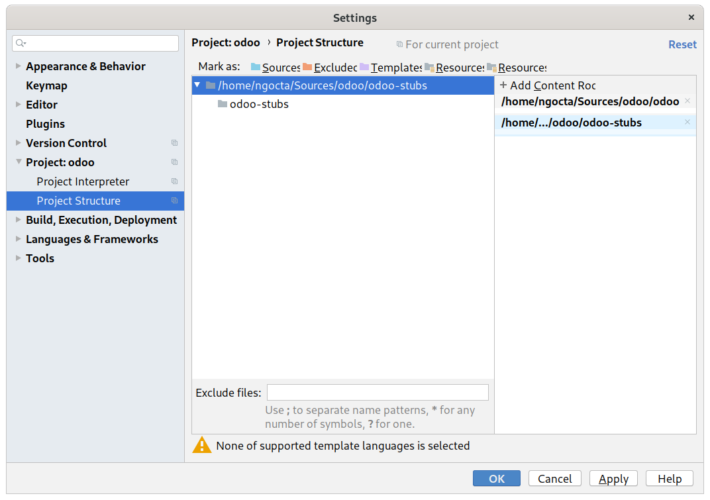
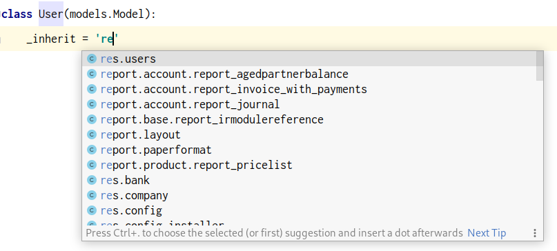
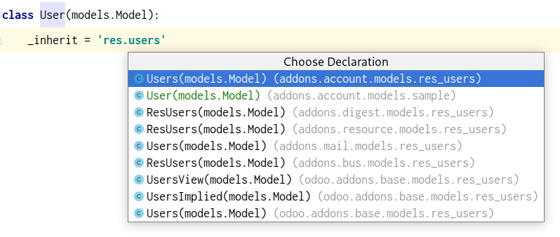
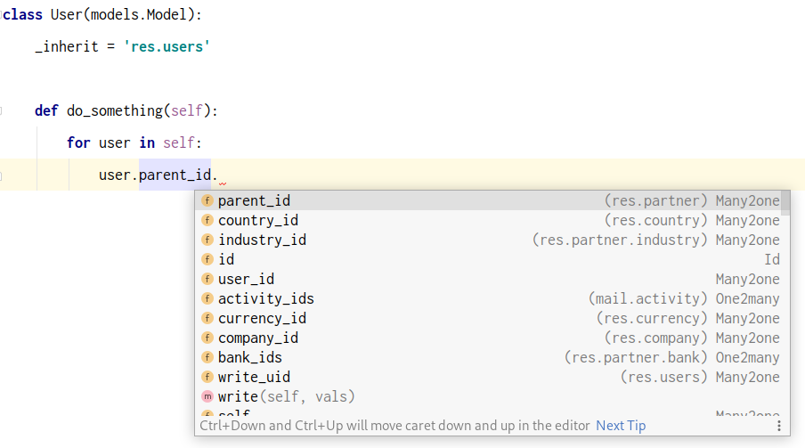
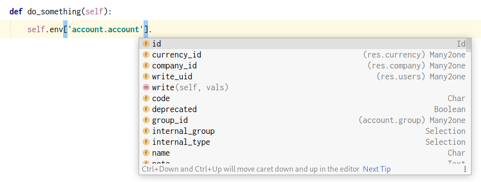
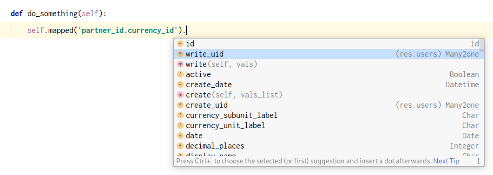
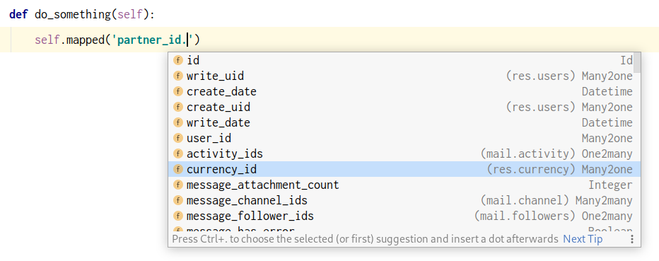
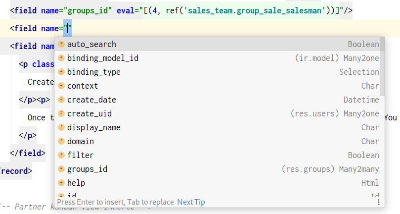
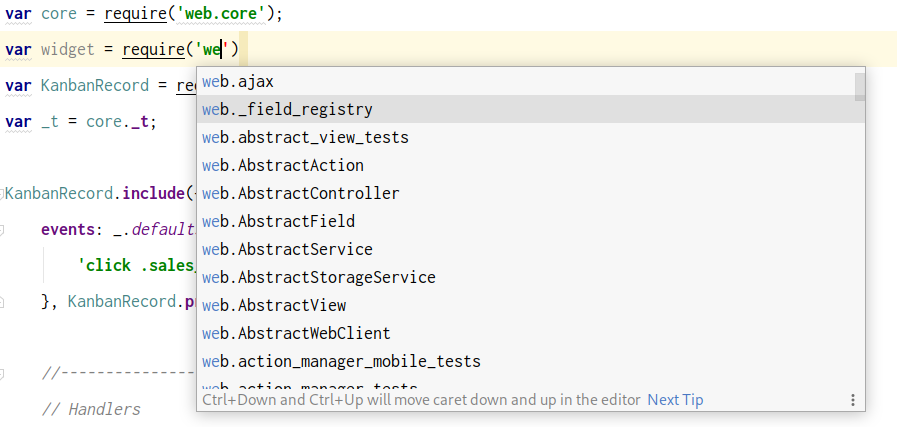

## Features
* Improve reference resolving and code completion for Python, XML and JavaScript files in Odoo</li>
* Improve Odoo XML formatter
* Improve structure view for model class
* Quick search and navigate to any XML ID in Odoo project
* ...

## Usage
1. Install this plugin from [Jetbrains Plugins Repository](https://plugins.jetbrains.com/plugin/13499-pycharm-odoo/)
or download and install latest version at [here](https://github.com/trinhanhngoc/pycharm-odoo/releases).
2. Clone [Odoo Stubs](https://github.com/trinhanhngoc/odoo-stubs) and attach to your project to improve code completion.

3. Install [XPathView](https://plugins.jetbrains.com/plugin/12478-xpathview--xslt) to quick navigate to inherited element in XML view.

## Screenshots
#### Python

#### XML

#### JavaScript

## Screencast
https://www.youtube.com/watch?v=SMqepH2A4_4